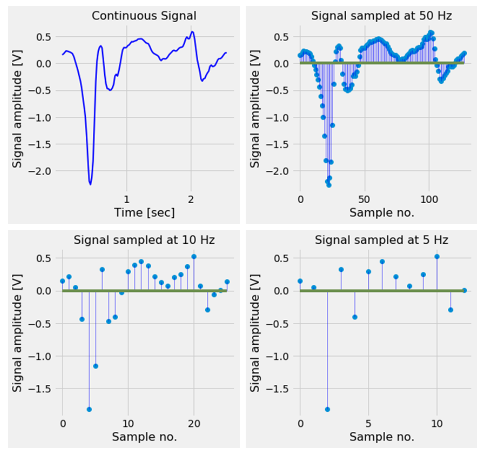
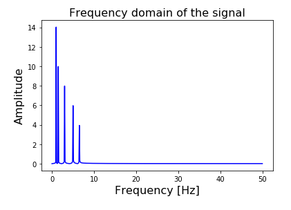
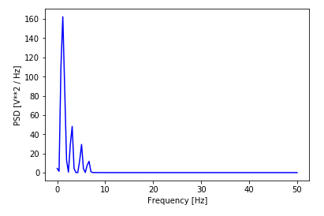
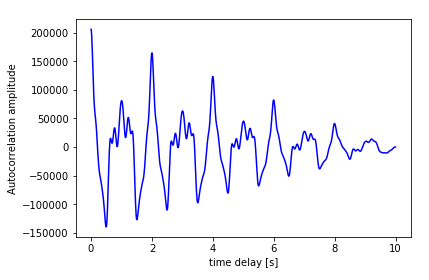
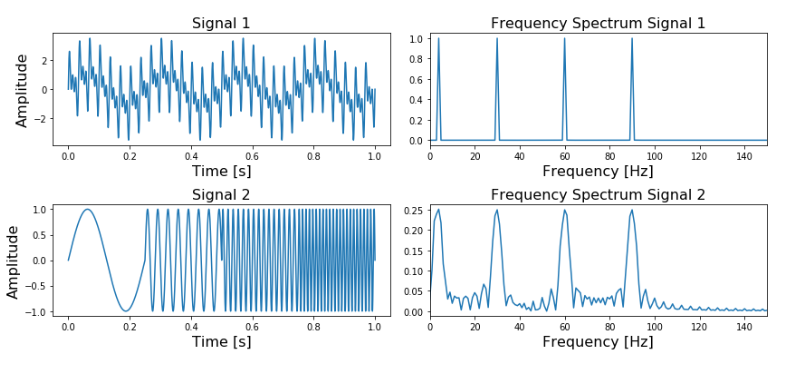

#베어링 고장 진단 프로젝트- Nasa Bearing Dataset


##🎯Domain Analysis:


도메인 분석(배경 분석)은 머신러닝 분석을 할 때 가장 중요한 과정이다. 분석하고자 하는 대상을 잘 이해해야 그에 적합한 데이터 전처리 및 분석 모델을 사용할 수 있기 때문이다. 이번 프로젝트에서 풀고자 하는 도메인은 베어링 예지 정비이다. 예지 정비란 이상치를 탐지하여 설비의 고장 이전에 정비를 하는 것을 말한다.


###⚙ 베어링:


베어링이란 '회전운동을 하는 축을 일정한 위치에서 지지하여 운동을 제한하고 마찰을 줄여주는 기계요소'를 지칭한다. 베어링은 거의 모든 회전체에 포함된다고 할 수 있다. 우리가 흔히 알고 있는 자동차 바퀴에도 베어링이 사용된다. 베어링이 없이 바퀴축이 온전히 지탱하게 했을 시, 바퀴 축이 힘을 온전히 받아 빠르게 마모될 가능성이 있다. 이렇듯 회전체가 회전시에 마찰을 획기적으로 감소시키는 주요 설비이다.


베어링 종류는 슬리브 베어링, 구름 베어링 크게 두가지로 나뉜다. 그 중 Nasa Bearing Dataset에 사용되는 베어링은 구름 베어링이다. 구름 베어링의 구조는 Cage 내에 고정되는 구름요소, 안쪽 내륜, 그리고 바깥 쪽 외륜으로 구성되어 있다. 베어링 결함은 이러한 구성요소 어디에서든지 진행 될 수 있다.


베어링에 하나의 결함이 발생하면 결함 주파수가 생기게 되며 성장시 베어링 내에 다른 결함을 일으키게 할 수 있다. 이렇게 되면 어떤 주파수들이 다른 주파수를 더하거나 빼 주기도 한다. 실제로 베어링 결함이 발생할 시 기본 주파수만 출력되는 경우는 없다. 결함 주파수는 이미 존재하고 있는 다른 주파수들의 측대파로써 작용한다. 예를 들어, Cage에서 결함이 발생할 시, Cage 자체 결함 주파수는 발생하지 않는다. 대신, 외륜 및 내륜의 주파수 혹은 구름요소의 결함 주파수의 측대파로 나타나게 된다. 따라서 문제의 목적에 따라 구하고자 하는 고정 주파수를 구하기 위해서는 filtering 방법이 사용되어야 한다.


###📈Filtering 방법:


대부분의 경우 베어링 주파수를 구할 때 베어링 결함 고유 주파수가 측정되는 것이 아닌 다른 요소에 의한 측대파로 나타난다. 따라서 받은 측대파를 filtering 방법을 거쳐 고유 주파수를 구해주는 과정을 거쳐야 한다. 이때 사용되는 Filtering 방법으로는 FFT, PSD, Auto correlation, Spectral Kurtosis + Hilbert transform이 있다. 


이러한 Filtering을 이해하기 앞서 기본적인 신호처리 방법에 대해 알 필요가 있다.


신호는 우리의 일상생활의 일부분이다. 오디오 신호, 사진, 비디오 모두 신호 형태로 있다. 이러한 신호는 연속적인 신호, 이산적인 신호 두가지로 나뉜다. 연속적인 신호는 우리가 자연 상태에서 들을 수 있는 신호들이다. 반면 이산적인 신호 같은 경우, 자연 상태의 신호를 디지털화 할 때 많이 사용된다. 머신러닝을 할때 측정된 데이터를 가지고 분석을 해야 하므로 이산신호를 다루게 될 것이다. 이렇게 신호를 가지고 분석을 하는 것을 신호처리라고 한다.


연속적인 신호를 이산적으로 바꾸는 과정에서 특정 sampling rate에서 sampling을 하는 과정을 거치게 된다.

 

그림에서 보다시피, sample rate을 10Hz로 했을 때 더 많은 데이터를 뽑게 되고 더 정교하게 복원할 수 있다. 반면 sample rate을 5Hz로 했을 때 데이터를 적게 뽑게 되고 덜 정교한 그래프를 복원하게 된다. Sample rate을 나이퀴스트 rate보다 적게 뽑았을 시, 원본(자연 데이터)를 복원할 수 없게 된다. 따라서 샘플링을 할 때는 나이퀘스트 rate보다 크게 뽑아야 한다.

####푸리에 변환(Fast Fourier Transform)


가장 대표적인 신호처리 방법이 Fast Fourier Transform이다. 푸리에 변환은 신호의 주기성을 공부할 때 사용되는 방법이다. 푸리에 변환은 신호들을 주파수 성분으로 분해하는 방법이다.


모든 신호는 더 간단한 형태의 신호 싸인 혹은 코싸인 형태의 신호의 합 형태로 분해가 가능하다. 시간 영역에서 주파수 영역으로 변환하는 것을 푸리에 변환이라고 부른다. 반대 과정(주파수 영역에서 시간 영역으로 변환)하는 것을 역푸리에 변환이라고 한다.


```Py

from scipy.fftpack import fft
 
def get_fft_values(y_values, T, N, f_s):
    f_values = np.linspace(0.0, 1.0/(2.0*T), N//2)
    fft_values_ = fft(y_values)
    fft_values = 2.0/N * np.abs(fft_values_[0:N//2])
    return f_values, fft_values
 
t_n = 10
N = 1000
T = t_n / N
f_s = 1/T
 
f_values, fft_values = get_fft_values(composite_y_value, T, N, f_s)
 
plt.plot(f_values, fft_values, linestyle='-', color='blue')
plt.xlabel('Frequency [Hz]', fontsize=16)
plt.ylabel('Amplitude', fontsize=16)
plt.title("Frequency domain of the signal", fontsize=16)
plt.show()
```

 

위 그림 같은 경우 fs가 100Hz이기 때문에 FFT 스펙트럼은 fs/2인 50Hz이다. fs 값이 클수록 FFT에서 더 큰 주파수를 계산할 수 있게 된다.


위 get_fft_values 함수 같은 경우, 복잡한 신호의 주파수 벡터 값을 return하게 된다. 또한 우리가 관심을 갖는 것은 증폭의 정도이기 때문에 절댓값을 취한다.


FFT는 N points의 신호 값을 return 할 것이고 이의 N/2 값이 의미 있는 값이며 그 전 값들은 유의하지 않다.


####PSD


PSD는 푸리에 변환과 메우 밀접한 연관이 있다. PSD 같은 경우, FFT값이 단순히 신호의 주파수 형태의 스펙트럼을 구한 것이라면, PSD는 그것에 파워 정도도 구한 것이라고 할 수 있다. 푸리에 변환과 거의 유사하나 각 신호의 peak 값의 높이 및 넓이가 다를 것이다. 

 

위 그림은 PSD를 시각화한 것이다. 


Scipy에서 제공하기 때문에 PSD(Power Spectral Density)를 코딩으로 계산하는 것은 쉽다.


```python
from scipy.signal import welch
 
def get_psd_values(y_values, T, N, f_s):
    f_values, psd_values = welch(y_values, fs=f_s)
    return f_values, psd_values
 
 
t_n = 10
N = 1000
T = t_n / N
f_s = 1/T
 
f_values, psd_values = get_psd_values(composite_y_value, T, N, f_s)
 
plt.plot(f_values, psd_values, linestyle='-', color='blue')
plt.xlabel('Frequency [Hz]')
plt.ylabel('PSD [V**2 / Hz]')
plt.show()

```

####Auto-correlation(자기 상관)


자기 상관함수는  신호와 시간 지연된 신호 자체의 상관계수를 계산한다. 어떤 신호에 T sec동안 하나의 주기를 반복을 하면, 해당 신호와 해당 신호 T 시간 지연된 신호와 강한 상관관계가 있을 것이다. 이러한 원리를 활용하는 것이 자기 상관함수이다.

```python

def autocorr(x):
    result = np.correlate(x, x, mode='full')
    return result[len(result)//2:]
 
def get_autocorr_values(y_values, T, N, f_s):
    autocorr_values = autocorr(y_values)
    x_values = np.array([T * jj for jj in range(0, N)])
    return x_values, autocorr_values
 
t_n = 10
N = 1000
T = t_n / N
f_s = 1/T
 
t_values, autocorr_values = get_autocorr_values(composite_y_value, T, N, f_s)
 
plt.plot(t_values, autocorr_values, linestyle='-', color='blue')
plt.xlabel('time delay [s]')
plt.ylabel('Autocorrelation amplitude')
plt.show()
```

 

자기 상관함수를 통해 생성된 값의 Peak값의 시간 축을 주파수 축으로 변환하면 FFT와 같은 값과 같게 된다.

####⚡Wavelet 방법:


앞서 푸리에 변환에 대해서 배운 바 있다. 푸리에 변환은 신호를 시간 차원에서 주파수 차원으로 변환하는 데 획기적인 기법이지만 시간을 반영하지 못한다는 치명적인 단점이 존재한다.


```Python
t_n = 1
N = 100000
T = t_n / N
f_s = 1/T
 
xa = np.linspace(0, t_n, num=N)
xb = np.linspace(0, t_n/4, num=N/4)
 
frequencies = [4, 30, 60, 90]
y1a, y1b = np.sin(2*np.pi*frequencies[0]*xa), np.sin(2*np.pi*frequencies[0]*xb)
y2a, y2b = np.sin(2*np.pi*frequencies[1]*xa), np.sin(2*np.pi*frequencies[1]*xb)
y3a, y3b = np.sin(2*np.pi*frequencies[2]*xa), np.sin(2*np.pi*frequencies[2]*xb)
y4a, y4b = np.sin(2*np.pi*frequencies[3]*xa), np.sin(2*np.pi*frequencies[3]*xb)
 
composite_signal1 = y1a + y2a + y3a + y4a
composite_signal2 = np.concatenate([y1b, y2b, y3b, y4b])
 
f_values1, fft_values1 = get_fft_values(composite_signal1, T, N, f_s)
f_values2, fft_values2 = get_fft_values(composite_signal2, T, N, f_s)
 
fig, axarr = plt.subplots(nrows=2, ncols=2, figsize=(12,8))
axarr[0,0].plot(xa, composite_signal1)
axarr[1,0].plot(xa, composite_signal2)
axarr[0,1].plot(f_values1, fft_values1)
axarr[1,1].plot(f_values2, fft_values2)
(...)
plt.tight_layout()
plt.show()
```

 

위 그림에서도 볼 수 있듯이 Signal1과 Signal2는 다른 파형을 띄고 있다. 하지만 푸리에 변환 시 동일한 값을 구한다는 것을 알 수 있다. 이는 푸리에 변환을 할 시 시간 차원을 고려하지 못하기 때문이다.


