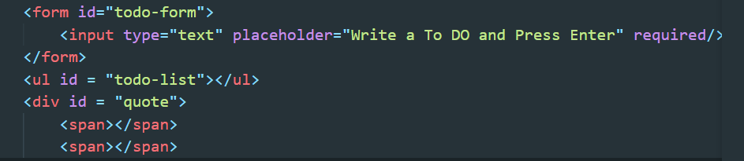

#ToDo 리스트 만들기

웹에서 바닐라 js를 통해 To Do-List를 만들어 보았다. 간단하게 사용자가 해야 할 일 목록을 생성하면 목록과 함께 지울 수 있는 버튼이 생긴다. 버튼을 클릭할 시, 목록을 지울 수 있다.

##실행 과정

1. html 파일에 Form 형태의 todo-form을 만들고, input, toDoList를 만든다.

   

    

2. 생성된 html 파일의 부분들을 지정하여 변수로 생성한다.

   이때 사용되는 getElementById

   
